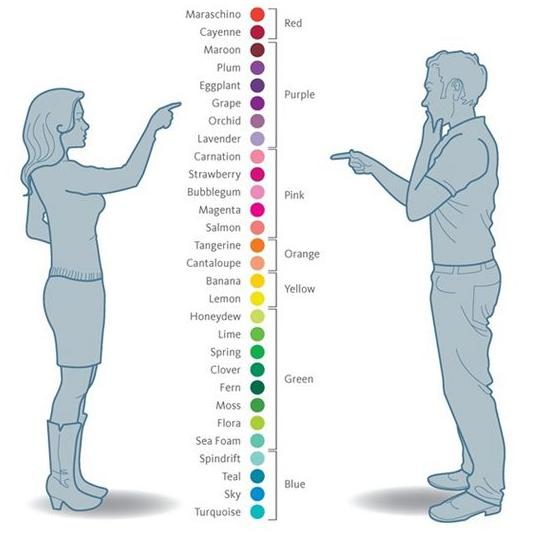

# Mihdan: Color Thief

Плагин под WordPress для определения цветов на фотогорафии при их загрузке в медиатеку. Цвета - это термины. Доминантный цвет записывается в метаполе `_yoast_wpseo_primary_colors` для изображения, чтобы указать плагину SEO by Yoast на основной цвет.

# Как работает


# Округление цвета

Плагин определяет (округляет) ближайший базовый цвет данного цвета из предустановленной палитры цветов.

Тестовое изображение:



# Базовая палитра

```
"964b00"   //Brown
"000000"   //Black
"403d3f"   //smoked (Turkish : Füme )
"808080"   //Gray
"f5f5dc"   //Beige (Turkish : Bej )
"ffffff"   //White
"ffcbdb"   //Pink
"ff00ff"   //Fuchsia (Turkish : Fuşya )
"9370db"   //Purple
"b03060"   //Claret Red (Turkish : Bize her yer trabzon! )
"0000ff"   //Blue
"40e0d0"   //Turquoise
"00ff00"   //Green
"ffff00"   //Yellow
"ff7f00"   //Orange
"ff0000"   //Red
```

# Requirements

* PHP >= 5.4 or >= PHP 7.0
* One or more PHP extensions for image processing:
* GD >= 2.0
* Imagick >= 2.0 (but >= 3.0 for CMYK images)
* Gmagick >= 1.0
* Supports JPEG, PNG and GIF images.

# Copyright

Плагин основан на [RoundColor](https://github.com/Projekod/RoundColor), [Color Thief](https://github.com/lokesh/color-thief) и [Color Thief PHP](https://github.com/ksubileau/color-thief-php).